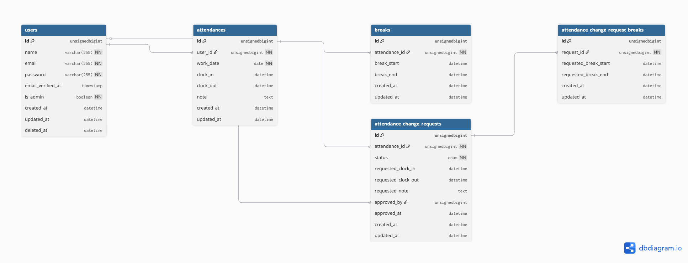

# time-management-app

## 概要

Laravelで開発した勤怠管理アプリです。

ユーザーは出勤・退勤・休憩の打刻を行うことができ、勤務時間の修正申請や管理者による承認機能を備えています。

## 主な機能
- 出勤・退勤・休憩の打刻
- 勤怠修正申請
- 管理者による修正申請の承認

## テーブル構成

- users:ユーザー情報を管理
- attendances:勤怠情報を管理
- breaks:休憩時間を管理
- attendance_change_requests:勤怠修正申請を管理
- attendance_change_request_breaks:勤怠修正申請の休憩
  時間を管理

## 環境構築

### Dockerビルド
1. `git clone git@github.com:ds1995-dev/time-management-app.git`
2. `docker compose up -d --build`

### Laravel環境構築
1. `docker compose exec php bash`
2. `composer install`
3. `cp .env.example .env`
4. `cp .env.testing.example .env.testing`
5. `php artisan key:generate`
6. `php artisan migrate`
7. `php artisan db:seed`

## ダミーデータ
Seeder実行後、以下の管理者アカウントでログインできます。

- email: `admin@example.com`
- password: `password`

## テスト

### テスト用データベース作成
1. `docker compose exec mysql bash`
2. `mysql -u root -p`
3. `root`を入力してログイン
4. 以下を実行

```sql
CREATE DATABASE test;
```

### テスト実行
1. `docker compose exec php bash`
2. `php artisan test`

- テストでは`.env.testing`のDB設定を使用します。
- テスト用データベースを事前に作成してください。

## 使用技術
- PHP 8.2 (php:8.2-fpm)
- Laravel 12.0
- Laravel Fortify
- MySQL 8.4
- Nginx (nginx:latest)
- phpMyAdmin (phpmyadmin/phpmyadmin)
- Mailtrap

## メール設定
メール送信にはMailtrapを使用しています。
.envにMailtrapのSMTP情報を設定してください。

## ER図



## URL

- 開発環境: http://localhost/
- 管理者ログイン: http://localhost/admin/login
- phpMyAdmin: http://localhost:8080/
